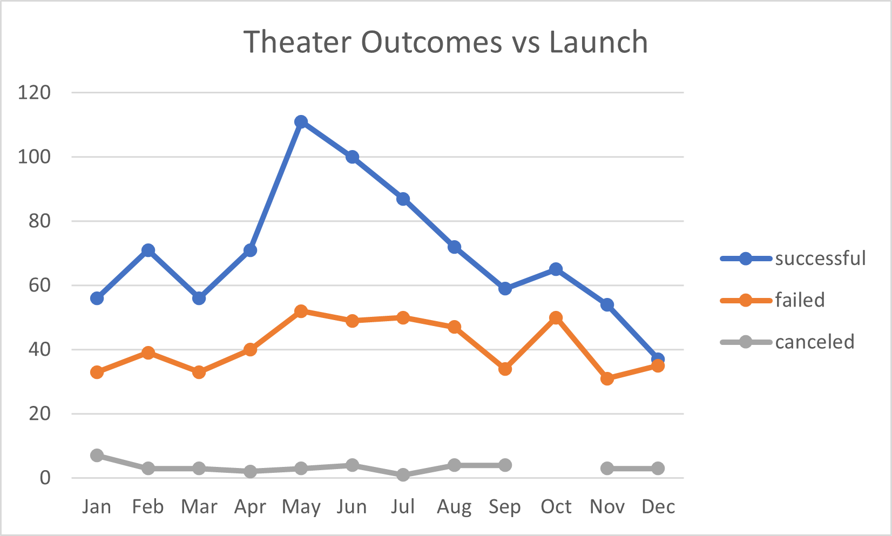
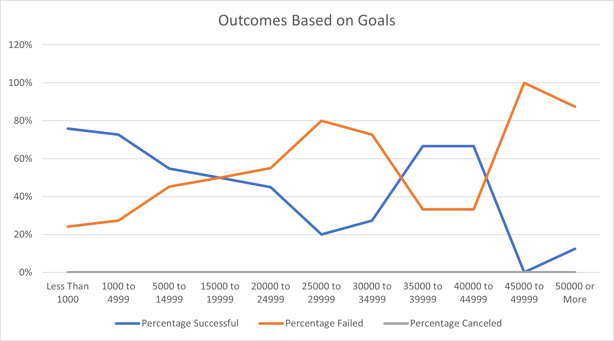

# Kickstarting with Excel 

## Overview of Project

### The purpose of this analysis is to idenify trends in successful, failed and canceled kickstarter campaigns based on launch dates and goals. More specifically, outcomes by launch dates includes only monthly data falling under the parent category of theater. Outcomes based on goals includes only data for the subcategory of plays.

## Analysis and Challenges

### Theatre Outcomes Based on Launch Date provides useful insight on when the best month is to launch a successful theatre campaign. This information was gathered by creating a pivot table using sucessful, failed and canceled campaigns based on the month a campaign started and then creating a visually pleasing and easy to read line chart. The biggest challenge while creating this was finding out how to filter out live theatre campaigns that may not provide useful information for this analysis due to the unkown outcome. Since we are not looking for live campign info, we can simpy filter out the column on the pivot table.

### Outcomes Based on Goals provides insight into the percentage of plays that were successful, failed or canceled baased on a defined range out set fundraising goals. While there were not any challenges creating this line chart, it is very possible that some may run into issues when trying to write the COUNTIFS formula. If you do not have the correct criteria selected, the data could be misinterpreted or he formula may not work.

### The biggest challenge when creating the pivot table is knowing which fields to drag and drop into the filters, columns, rows and values. With a little experimentation I was able to determine what fields to include in order to paint the picture, so to speak.

## Results

- What are two conclusions you can draw about the Outcomes based on Launch Date?
The best time to launch a successful theatre campaign is the month of May. The best season to start a successful kickstarter campaign is the summer. 
- What can you conclude about the Outcomes based on Goals?
A successful play typically has a fundraising goal of no higher than $14,999. More specifically, the highest success rate for a play is between a goal of $1,000 and $4,999.
- What are some limitations of this dataset?
Some possible limitations of the kickstarter data include unkown information about the target audience for categories such as plays. Target audiences may include different age groups and different cultures. 
- What are some other possible tables and/or graphs that we could create?
We could also use this data to creat a box and whiskers graph in order to show any outliers and whether or not the data is skewed.
