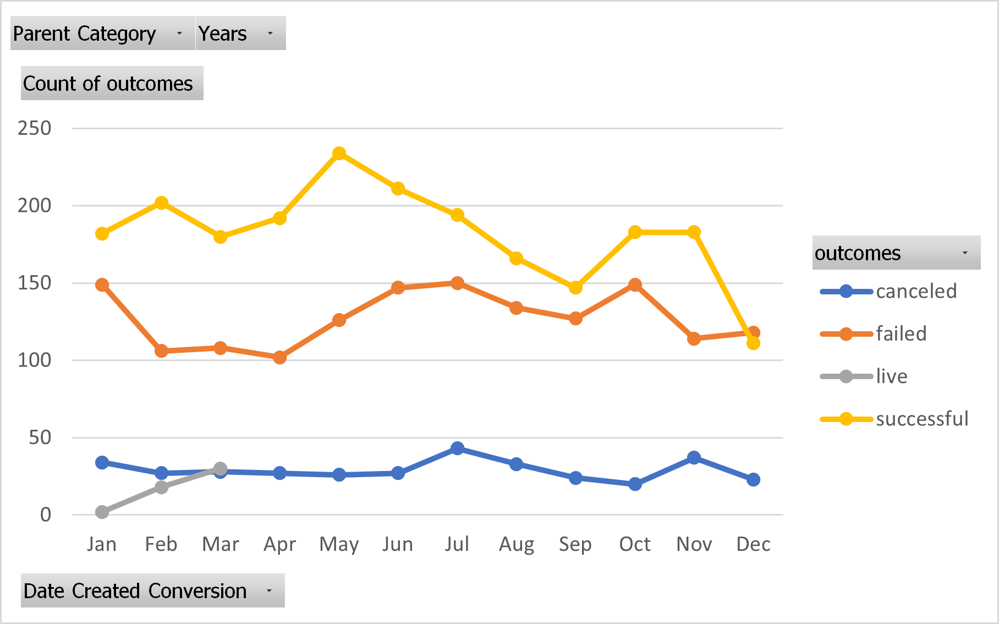

# An Analysis of Kickstarter Campaigns
This anlaysis identifies trends between different categories of kickstarter campaigns over a period of time. 

Based on the data for musicals in Great Britain, I would recomment keeping the estimated budget near or below £4,000. For a successful kickstarter in the United States, I would recommend an estimated budget of around $5,000 or lower.
